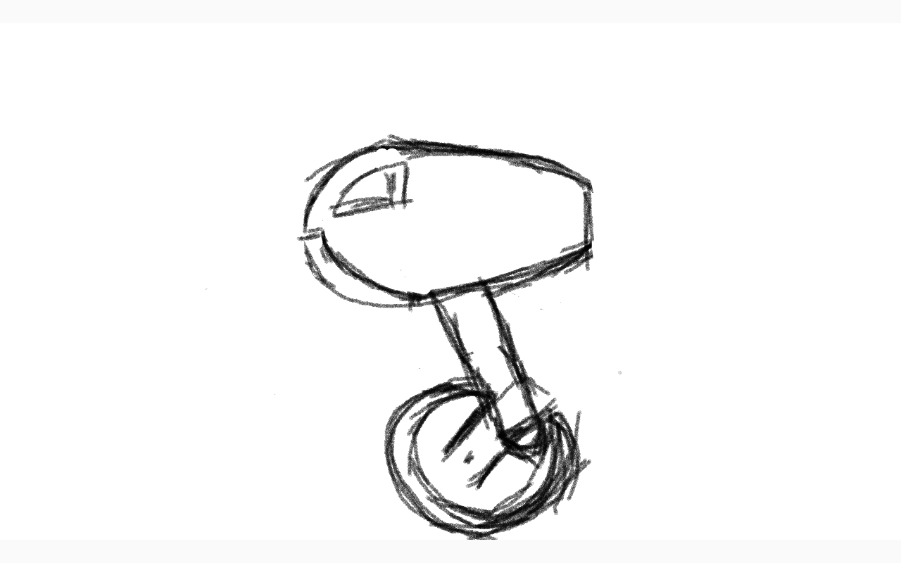

# Build and Gathering Device (BAGDEV)

Ist eine kleine Einheit bestehend aus einem Additiven Fertigungstool mithilfe welchem es Strukturen erstellen kann, und einer Abbaueinheit die Resourcen extrahieren kann.

Auf der Sycia dienen die BAGDEVs zum erweitern der Solarsegel und zum Abbau der Resourcen auf Asteroiden.

