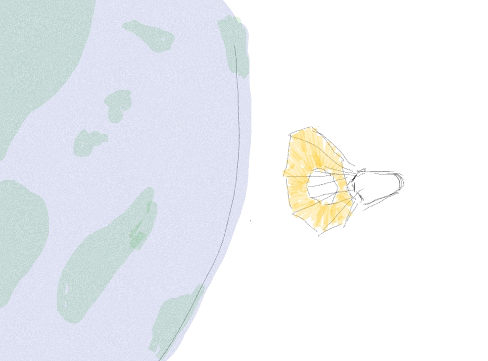

Die Sycia ist eines von 6 Genomschiffen die von einem Internationalen Gremium zwischen 2134 und 2139 gestartet wurden. 

Sycia besteht aus Einer Fläche aus Solarsegeln, die wärend des Fluges erweitert wird um mehr Geschwindigkeit aufzubauen. Dies geschieht mithilfe von [Multifunktionalen Drohnen BAGDEV](bagdev.md) 

