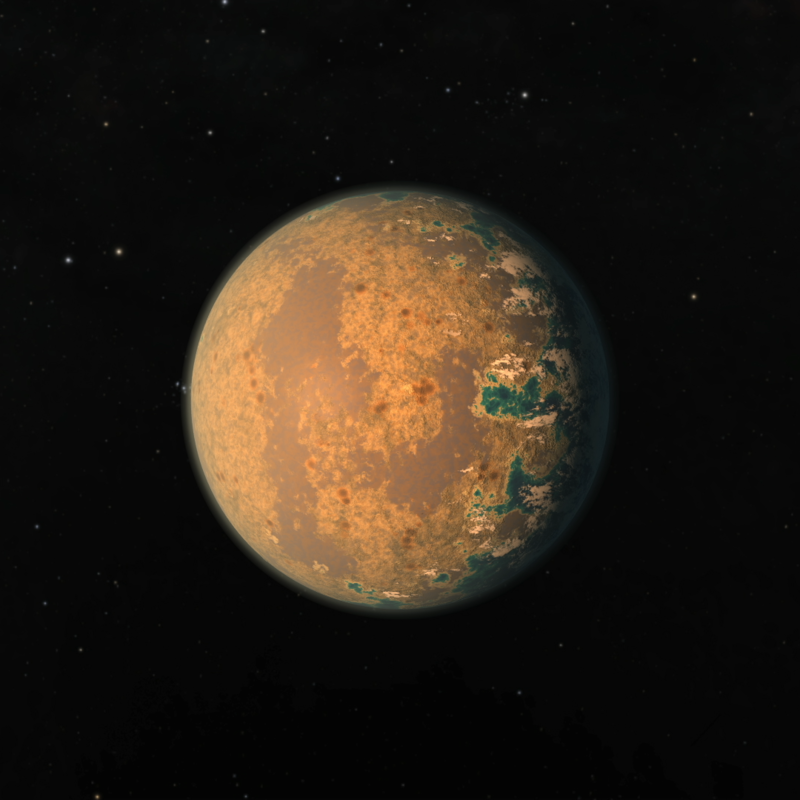
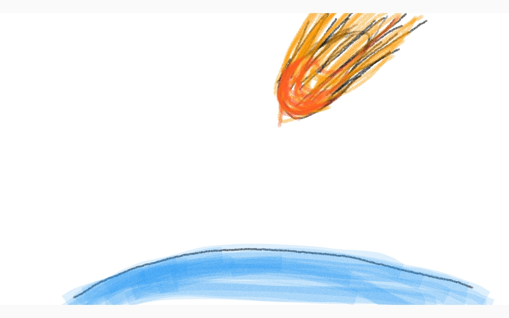
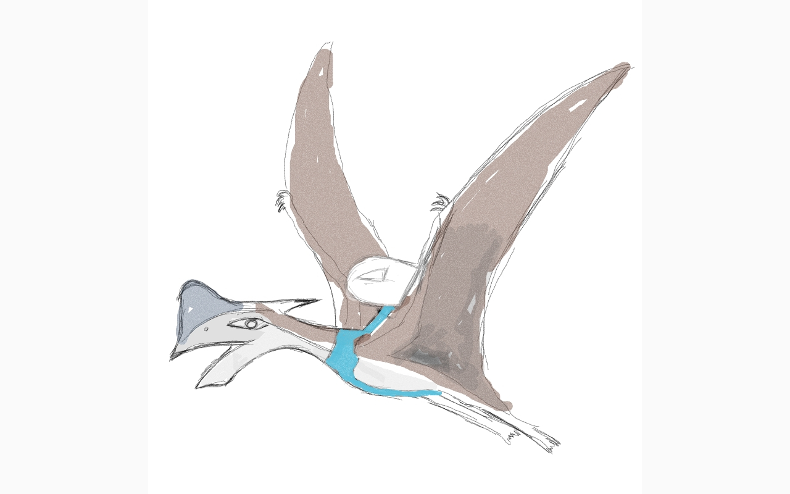

# [TRAPPIST-1D](https://exoplanets.nasa.gov/exoplanet-catalog/3453/trappist-1-d/)

Das Zielsystem TRAPPIST-1 besteht aus 7 Planeten, 3 davon in der Habitablen Zone. Der erste Planet der mit genomen bestückt wurde ist TRAPPIST-1D 

Hier wurden Kreaturen aus den Erdzeitaltern Jura und Kreide ausgesetzt.

Ihre Aufgabe besteht darin ein Gleichgewicht zwischen den Arten herzustellen, da sich diese ohne Hilfe zu schnell dezimieren. 

